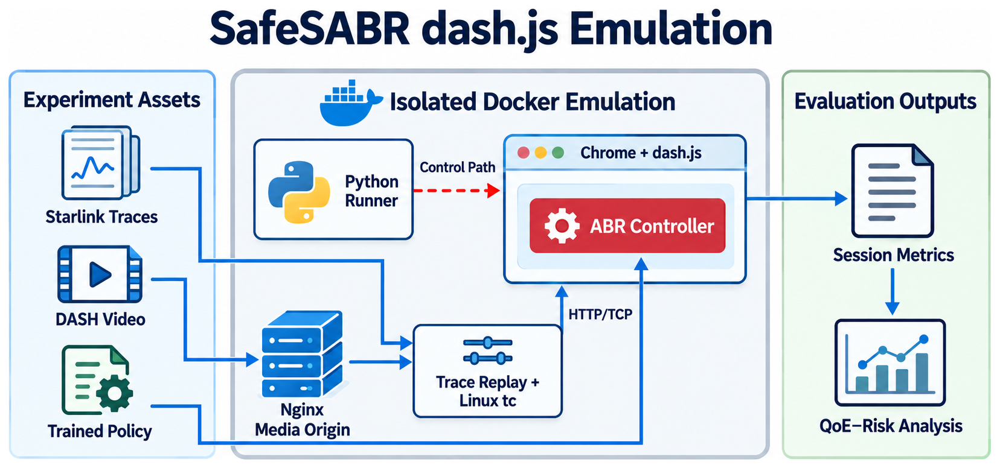
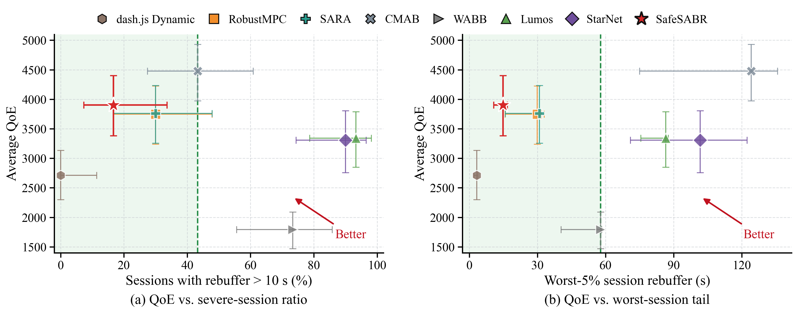
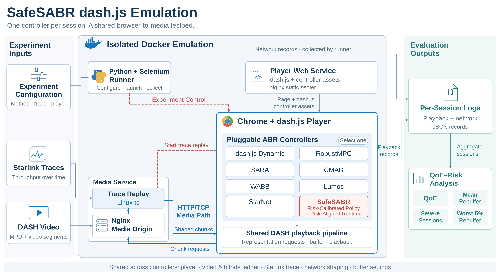

# SafeSABR dash.js Emulation

[](https://arxiv.org/abs/2605.23560)
[](https://github.com/luopeng69131/SafeSABR)
[](LICENSE)

[中文说明](README_zh.md)

This repository provides the browser-based evaluation artifact for
**SafeSABR**, a risk-calibrated adaptive bitrate (ABR) framework for video
streaming over volatile Starlink links. It reproduces the paper's dash.js
experiment through a complete HTTP/TCP playback path comprising Chrome,
dash.js, Media Source Extensions, and an isolated Linux traffic shaper.

The repository includes the trained SafeSABR policy, its runtime risk model,
the fixed 30-session Starlink trace set, all evaluated ABR implementations,
and the scripts used to regenerate the paper's metrics and figures.

## Emulation at a Glance



The experiment runs in isolated Docker networks. A Python runner controls the
Chrome-based dash.js player, while an Nginx media origin serves the DASH video
through a Linux traffic shaper driven by the selected Starlink trace. The
player exports session-level measurements for the common QoE and severe-risk
analysis.

## Reference Results

Each method is evaluated on the same 30 Starlink sessions: 10 from each of the
US, OSN, and VIC trace groups. A session is severe when its cumulative
rebuffering exceeds 10 seconds; Worst-5% is the mean rebuffering of the two
most severely stalled sessions.



| Method | QoE | Mean rebuffer (s) | Severe sessions (%) | Worst-5% (s) |
|:--|--:|--:|--:|--:|
| dash.js Dynamic | 2713.32 | **0.70** | **0.00** | **3.32** |
| RobustMPC | 3748.10 | 7.89 | 30.00 | 29.89 |
| SARA | 3758.98 | 7.96 | 30.00 | 30.89 |
| CMAB | **4479.22** | 26.42 | 43.33 | 124.14 |
| WABB | 1792.86 | 20.15 | 73.33 | 57.81 |
| Lumos | 3339.84 | 41.28 | 93.33 | 86.52 |
| StarNet | 3306.97 | 38.23 | 90.00 | 101.66 |
| **SafeSABR** | **3903.70** | **5.73** | **16.67** | **14.84** |

Full per-session and paired statistics are available in
[`artifacts/paper`](artifacts/paper).

## Emulation Details



Each session selects one pluggable ABR controller inside the shared dash.js
player. The runner, browser, player service, media origin, trace replay, and
evaluation path remain common across all methods.

## Reproduction Pipeline

### Requirements

- Linux with Docker Engine and Docker Compose v2
- Python 3.11 or newer
- At least 8 GB of free disk space for generated DASH media and containers
- At least 8 GB of memory for the default serial execution

No host-level traffic-control command is used. Network shaping runs inside an
isolated Docker container with a dedicated network namespace.

### 1. Prepare the Environment

```bash
bash scripts/prepare_runtime.sh
```

This command verifies the included artifacts, generates the six-representation
192-second DASH video, extracts exact chunk sizes, and builds the containers.

### 2. Run a Smoke Test

```bash
bash scripts/run_smoke.sh
```

The smoke test runs both dash.js Dynamic and SafeSABR on a short trace.

### 3. Reproduce the 30-Session Experiment

```bash
bash scripts/run_paper_experiment.sh
```

The default run evaluates all eight methods sequentially. To run selected
methods, use the public names below:

```bash
METHODS="robustmpc sara safesabr" bash scripts/run_paper_experiment.sh
```

Supported names are `dashjs`, `robustmpc`, `sara`, `cmab`, `wabb`, `lumos`,
`starnet`, and `safesabr`. Completed sessions are detected and skipped, so an
interrupted batch can be resumed with the same command.

On a machine with sufficient CPU and memory, parallel execution can be enabled
explicitly:

```bash
WORKERS=5 bash scripts/run_paper_experiment.sh
```

### 4. Recompute Tables and Figures

```bash
python3 -m pip install -r requirements-analysis.txt
bash scripts/analyze_results.sh
```

New outputs are written to `results/paper/analysis`. Browser timing can vary
slightly with host load; the frozen results reported in the paper are retained
under `artifacts/paper` for comparison.

## Repository Layout

| Path | Contents |
|:--|:--|
| `app/` | dash.js player, ABR rules, SafeSABR policy, and Risk-Aligned Runtime |
| `app/assets/` | trained policy, runtime risk model, and baseline inputs |
| `data/starlink_holdout30/` | included 30-session Starlink trace set |
| `data/manifests/` | evaluation order, regions, and trace metadata |
| `runner/` | Selenium-based Chrome experiment runner |
| `shaper/` | isolated HTTP media origin and trace replay |
| `tools/` | batch execution, media generation, analysis, and plotting |
| `artifacts/paper/` | reference metrics, per-session results, and paper figures |
| `docs/` | implementation, dataset, baseline, and reproduction details |

## Data and Models

The included traces are processed from the
[StarNet measurement dataset](https://github.com/ConnectedSystemsLab/StarNet)
and cover three measurement regions. Their provenance, format, and selection
procedure are documented in [docs/DATASET.md](docs/DATASET.md).

The exported SafeSABR policy and runtime risk model are included in
`app/assets/`. Run the following command at any time to verify their checksums,
the trace manifest, the pinned dash.js asset, and the reference results:

```bash
python3 scripts/verify_artifact.py
```

## Method Implementations

All methods share the same browser, media, trace, network shaper, bitrate
ladder, and buffer configuration. The LEO-aware methods are adapted to the
common fixed-duration VOD action space where their original systems use a
different playback mode or additional controls. See
[docs/BASELINES.md](docs/BASELINES.md) for exact implementation boundaries and
source references.

## Citation

```bibtex
@misc{xie2026safesabrriskcalibratedadaptivebitrate,
  title         = {SafeSABR: Risk-Calibrated Adaptive Bitrate Streaming over Starlink Networks},
  author        = {Hongjun Xie and Jiahang Zhu and Zhiming Shao and Chao Fan and Zenghui Zhang and Genke Yang and Pengcheng Luo},
  year          = {2026},
  eprint        = {2605.23560},
  archivePrefix = {arXiv},
  primaryClass  = {eess.SY},
  url           = {https://arxiv.org/abs/2605.23560}
}
```

## Acknowledgments

This artifact builds on [dash.js](https://github.com/Dash-Industry-Forum/dash.js)
and the [StarNet](https://github.com/ConnectedSystemsLab/StarNet) measurements.
We also thank the authors of
[comyco-lin](https://github.com/godka/comyco-lin),
[pensieve_retrain](https://github.com/GreenLv/pensieve_retrain), and the
[MMSys 2024 Starlink live-streaming artifact](https://github.com/clarkzjw/mmsys24-starlink-livestreaming)
for making their implementations available to the community.

## License

SafeSABR source code in this repository is released under the
[Apache License 2.0](LICENSE). Referenced third-party software and datasets
remain subject to their respective terms.
